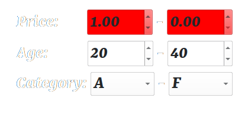

<!-- Improved compatibility of back to top link: See: https://github.com/othneildrew/Best-README-Template/pull/73 -->
<a name="readme-top"></a>
<!--
*** Thanks for checking out the Best-README-Template. If you have a suggestion
*** that would make this better, please fork the repo and create a pull request
*** or simply open an issue with the tag "enhancement".
*** Don't forget to give the project a star!
*** Thanks again! Now go create something AMAZING! :D
-->


<!-- PROJECT SHIELDS -->
<!--
*** I'm using markdown "reference style" links for readability.
*** Reference links are enclosed in brackets [ ] instead of parentheses ( ).
*** See the bottom of this document for the declaration of the reference variables
*** for contributors-url, forks-url, etc. This is an optional, concise syntax you may use.
*** https://www.markdownguide.org/basic-syntax/#reference-style-links
-->
[![LinkedIn][linkedin-shield]][https://www.linkedin.com/in/vrahmanifard/]


<!-- PROJECT LOGO -->
<br />
<div align="center">
  <a href="https://github.com/vRFEducation/vcricularprogressbarwidget">
    
  </a>

<h3 align="center">Range Selector Widgets</h3>

  <p align="center">
    In this project I'm gonna create a collection of plugins known as custom widgets for Qt framework that can be used both at run time and design time.
    Usually we need to get ranged information from user such as price range, age range or even an ordered category range. For this purpose we often add some widget to ui and this is a tedious.
    So I create 3 different custom widgets for getting flaot, int and categorised data. These widgets can be customized either at design time or run time using some properties.
  </p>
</div>


<!-- TABLE OF CONTENTS -->
<details>
  <summary>Table of Contents</summary>
  <ol>
    <li>
      <a href="#about-the-project">About The Project</a>
      <ul>
        <li><a href="#built-with">Built With</a></li>
      </ul>
    </li>
    <li>
      <a href="#getting-started">Getting Started</a>
      <ul>
        <li><a href="#prerequisites">Prerequisites</a></li>
        <li><a href="#installation">Installation</a></li>
      </ul>
    </li>
    <li><a href="#usage">Usage</a></li>
    <li><a href="#roadmap">Roadmap</a></li>
    <li><a href="#contributing">Contributing</a></li>
    <li><a href="#license">License</a></li>
    <li><a href="#contact">Contact</a></li>
    <li><a href="#acknowledgments">Acknowledgments</a></li>
  </ol>
</details>


<!-- ABOUT THE PROJECT -->
## About The Project
[Product Name Screen Shot][product-screenshot1]
[Product Name Screen Shot][product-screenshot2]


<p align="right">(<a href="#readme-top">back to top</a>)</p>


### Built With

* [![Qt][Qt.io]][qt-url]

<p align="right">(<a href="#readme-top">back to top</a>)</p>


<!-- GETTING STARTED -->
## Getting Started
This project build using Qt framework 6.3 and also compatible with Qt 5.x;
In order to use it, just open the project in Qt Creator(this is a Custom Widget Project type) and compile the project. there will be a library with .so(in case you'r using linux and .dll for windows user) extension in build folder.
Copy generated library to a folder for Qt Creator plugins inside the location Qt installed. Path to this folder is something like "/home/vrf/Qt/Tools/QtCreator/lib/Qt/plugins/designer". Just replace the path that Qt installed on your system.

Next, open Qt Creator and if vSelectors section is not appear in toolsbox goto "Tools->Form Editor->About Qt Designer Plugins" and then just click Refresh. Now you should see widget(s) in toolsbox.

Warning: please take care that library should built with a compiler compatibale with the one that Qt Creator had built. For more information just check "Help->About Qt Creator".

Now you can drag & drop any of range selectors on main form and customize it's attributes from properties windows on the right side.

You should also add this library and related .h files(VFloatRangeSelector.h, VIntegerRangeSelector.h, VComboRangeSelector.h) to your project in order run the project successfully

### Prerequisites

All you need to make use of this library is Qt itself and nothing more

### Installation

1. Install Qt
2. Clone the repo
   ```sh
   git clone https://github.com/vRFEducation/vrangeselectorcollection.git
   ```
3. Open Project and Compile it
4. Copy .so(in case using linux) to Qt Creator plugins directory
5. Add .so file to your project
6. enjoy the widget at design time


<p align="right">(<a href="#readme-top">back to top</a>)</p>


<!-- USAGE EXAMPLES -->
## Usage
These widgets are useful whereever you want to get a range value from user. So instead of reinventing the wheel just drag & drop appropriate widget on form and get rid of all unnecessary activities.


<p align="right">(<a href="#readme-top">back to top</a>)</p>


<!-- CONTRIBUTING -->
## Contributing

If you have a suggestion that would make this better, please fork the repo and create a pull request. You can also simply open an issue with the tag "enhancement".
Don't forget to give the project a star! Thanks again!

1. Fork the Project
2. Create your Feature Branch (`git checkout -b feature/AmazingFeature`)
3. Commit your Changes (`git commit -m 'Add some AmazingFeature'`)
4. Push to the Branch (`git push origin feature/AmazingFeature`)
5. Open a Pull Request

<p align="right">(<a href="#readme-top">back to top</a>)</p>


<!-- LICENSE -->
## License

Distributed under the MIT License. See `LICENSE.txt` for more information.

<p align="right">(<a href="#readme-top">back to top</a>)</p>


<!-- CONTACT -->
## Contact

Vahid Rahmanifard - rahmanifard@live.com

Project Link: [https://github.com/vRFEducation/vrangeselectorcollection](https://github.com/vRFEducation/vrangeselectorcollection)

<p align="right">(<a href="#readme-top">back to top</a>)</p>


[product-screenshot1]: images/Demo1.png
[product-screenshot2]: images/Demo2.png
[linkedin-shield]: https://img.shields.io/badge/-LinkedIn-black.svg?style=for-the-badge&logo=linkedin&colorB=555
[linkedin-url]: https://linkedin.com/in/vrahmanifard
[qt-url]: https://qt.io/

